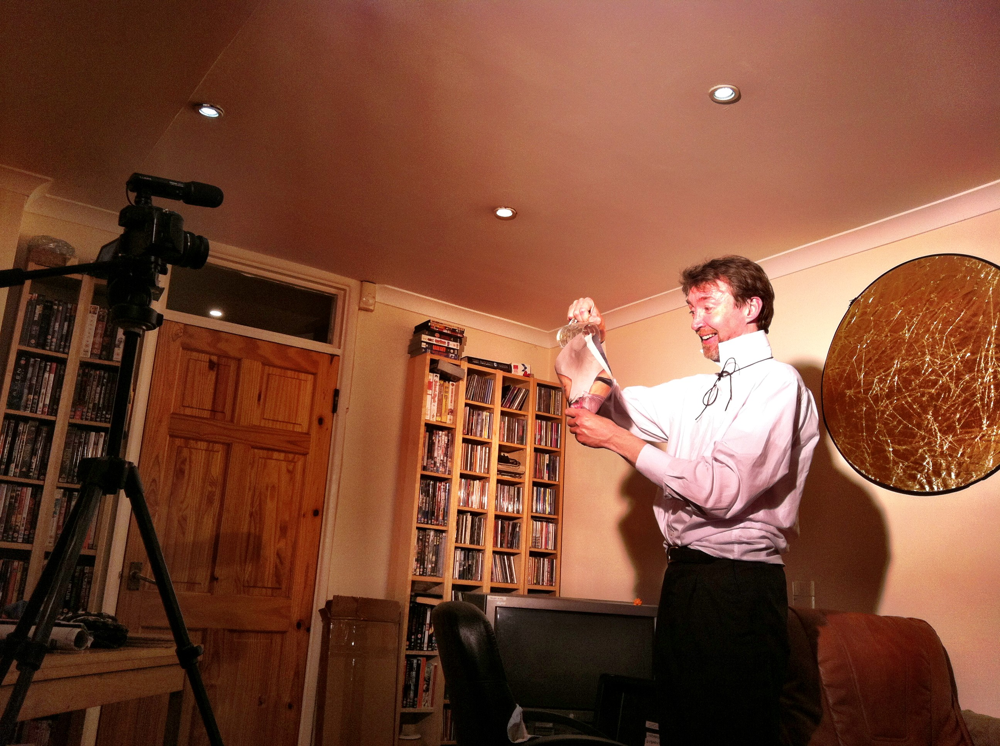

--- BEGIN YAML HEADER ---
layout: post
summary: We ran a shoot one evening to record a VLOG for a friend, here's what happened....
---- END YAML HEADER ----

If you've read my [about](/about_me.html "about me") page you may have spotted I do bits of filming, as well as doing [film challenges](/posts/2013-03-09-48_hr_film_challenge_practice.html "a 48hr practice Challenge") we also do less time constrained shoots, like the one last night. 

One of the nice things about not working to a tight deadline is that it gives us a chance to try new things within the crew without becoming a liability (you don't want you camera man to not know how to use the camera if you only have 2 days to teach them). So, rather than my habitual position: holding a long pole with a microphone stuck to it I was ingest editor for an evening. 

Ingest editor is an odd position, basically it was my job to be in charge of ctrl+c/ctrl+v. At random points throughout the shoot I get given data cards (normally SD cards) which I then have to copy on to which ever computer we're using for editing. Once copied I make sure that the data's backed up (normally by copying to an external hard drive) and then I start to load the footage and sound into what ever we're using for editing (currently Adobe Premier)






