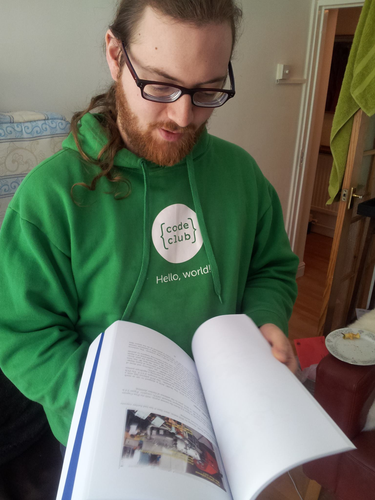

--- BEGIN YAML HEADER ---
layout: post
summary: My thesis
---- END YAML HEADER ----

Any of you who know me or have read my about page will know I've spent the last 4.5 years of my life working towards my Doctorate of Philosophy AKA PhD. in particle/high energy physics. 

As part of this I've been very lucky to be involved in two awesome projects: MuSIC [[1](#footnote1)] and the (Eu-XFEL)[http://xfel.eu XFEL]. MuSIC is a muon beam (muons the same as electrons but 200x heavier) whilst Eu-XFEL is a 2.4 X-ray laser. 

For MuSIC I got to do pretty much everything: I built our detector, our DAQ, simulated the experiment and analysed the results. In contrast Eu-XFEL is a *huge* project, for it I wrote the firmware that acts as an interface between two components [[2](#footnote2)].

Anyway my thesis is not (in anyway) ground-breaking but it covers my work on these two projects. My supervisor for this ([Prof. Matthew Wing](https://www.hep.ucl.ac.uk/~mw/)) is working on a paper about the MuSIC results: we think we've got a pretty good case that MuSIC is the most efficient muon beam in the world (in terms of muons per Watt of proton beam) which is pretty cool. The next obvious test is when Eu-XFEL switches on (I think some time in 2016) although my firmware has passed preliminary trials (which is relieving).

The next big thing for me personally is my Viva (currently 4th June) when (hopefully) I'll become a doctor (ideally with only minor corrections).

Anyway if you look right to the sidebar you (should) see a link where you can download my thesis (for what ever reason) and here's a picture of me with my two copies for submission to examiners. For those of you that are curious the final document is 182 pages and ~45k words (9MB as a pdf).

------

[1] MuSIC is too small an experiment to have a web presence, sorry.[*[back](#jumpback1)*]

[2] The firmware on the Large Pixel Detector and the Clock and Control Card if you're interested. [*[back](#jumpback2)*]



[My thesis](../docs/thesis_bound_2014-04-10.pdf "download") [~9MB pdf]
