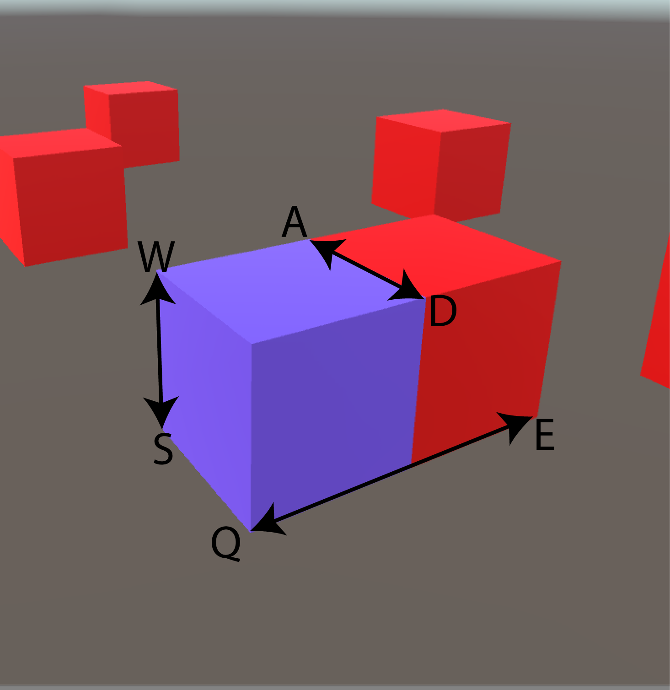

--- BEGIN YAML HEADER ---
layout: post
summary: My first game in Unity 5.
---- END YAML HEADER ----


Month 3 of game making (sort of) and I've got another game [[1](#footnote1)]! This one you actually have to download and run and everything (neat, eh?). It's a very simple block puzzle. In fact so simple it won't even tell you when you win or lose: it will just put you back at the start of the single level I've made so far. So that you know: you 'win' when you get to the white cube.

Your cube (the purple one) can move any distance along the 3 main axes. By default you control your movement using 'wasd' (+'qe'). As this is a Unity game though you can change these in the dialog box that opens when you start the game (under the 'horizontal', 'vertical' and 'forward/backward' axes).

As long as there's a block along your line of motion you stick to it. If you 'glance' another block you stick to that (there's a reason but I'll get to that in a second). If there's no block you fly off into the distance and go back to the start.

If all you want to do is play the game (all 1 minute of it) that's all you need. The rest of this is me blathering about some things I want to change, some things I like and what I want to do next.

I think the biggest thing to change is the control scheme. Firstly the fixed camera is a pain as you can't really plan a route, secondly the wasd+ control scheme isn't very natural. My currently plan is to switch to more of a point and shoot design where, based on the camera angle, the player presses a single button and launches along the forward direction of that view. Hopefully this will make control more intuitive whilst also making viewing the level easier.

As to something I like it started as one of the more annoying things about designing this game: coming up with a method whereby the route wasn't obvious but you could still backtrack. The problem with fulfilling both of these is that it requires you to allow 'glancing' grabs (another solution would be to have an 'undo' button but that feels clunky). The reason glancing grabs have to be allowed is that otherwise the route becomes too obvious as the blocks that allow backtracking point the way, hence allowing the glancing grabs. The only downside with the glancing grabs is that it makes planning the levels a little more tricky as it's not just blocks in line with any particular block that can get to it. That being said this means making alternative 'hidden' solutions a little easier.

As to future plans currently they're just to make a few more basic levels. To aid this I'm contemplating making some sort of Unity plugin for positioning the blocks as the current method is to manually input the position that and that's tedious. It would also be nice to make some sort of auto tester that checks which finds viable and un-viable routes through the levels although I don't know how I might do this (or the plugin but I think that's at least vaguely possible). With regards to the game itself I want to increase the range of grab-blocks as well more prosaic things like scoring and menus. In terms of grab blocks I already have plans for switches and possibly some cloning/splitting device that forces you to control two blocks around the level.

If you liked the game any feedback can be sent to [games@samlr.com](mailto:games@samlr.com).

----

&nbsp;

&nbsp;

&nbsp;

&nbsp;

[1] The previous month's efforts are: [A javascript platformer](2015-03-22-First-try-at-a-game.html) and [a card game](2015-05-09-Card-game.html). [*[back](#jumpback1)*]




## Download links ##
* [Mac OS X](../docs/block-puzzle/block-puzzle_mac-osx_0.0.1.zip)
* [Windows](../docs/block-puzzle/block-puzzle_windows_0.0.1.zip)

**Mac**: unzip the file then open 'scene1_v0.0.1.app'.

**Windows**: unzip the file, open the folder then open 'scene1_v0.0.1.exe'

